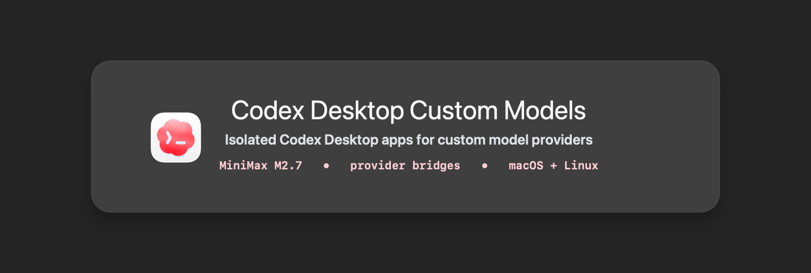
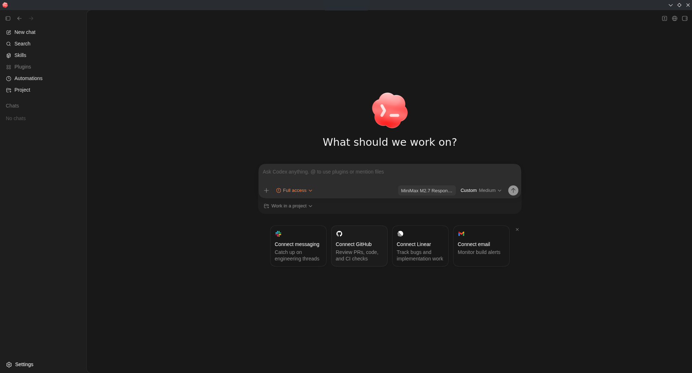

<p align="center">
  
</p>

<h1 align="center">Codex Desktop Custom Models</h1>

<p align="center">
  Create isolated Codex Desktop apps for custom model providers on macOS and
  Linux, with separate icons, state, provider bridges, and automations.
</p>

<p align="center">
  An open-source project by <a href="https://github.com/ademisler">Adem İşler</a>.
  Released under the MIT License.
</p>

---

## What This Is

Codex Desktop Custom Models is a starter kit for people who already have Codex
Desktop installed and want a second, independent Codex app for a custom model
provider.

The reference app is **Codex MiniMax**: a red-icon Codex Desktop profile that
uses MiniMax M2.7 through a local OpenAI-compatible bridge.

It does not modify your original Codex app. Your normal Codex install keeps its
own config, data, sessions, provider, icon, and launcher.

<p align="center">
  
</p>

## Open Source

This project is released under the MIT License. You can use it, fork it, adapt
it for other providers, and contribute fixes through pull requests.

## What You Get

| Part | Purpose |
| --- | --- |
| Isolated app clone | Creates a side-by-side Codex Desktop app with its own app id, launcher, icon, and webview port. |
| Separate `CODEX_HOME` | Keeps custom app state away from your main `~/.codex`. |
| Provider bridge | Converts Codex Responses API calls into OpenAI-compatible Chat Completions calls. |
| MiniMax profile | Ready example for MiniMax M2.7 using your own API key. |
| macOS and Linux paths | Supports a macOS app-bundle profile and a Linux desktop-shell profile. |
| Automation support | Local MCP server and runner for reminders, monitors, and same-thread follow-ups. |
| Publishing assets | Clean README hero, real screenshot, red icon, diagrams, examples, and docs. |

## The Result

After setup you can have both apps installed at the same time:

| Original Codex | Custom Codex MiniMax |
| --- | --- |
| Uses your normal Codex setup | Uses `~/.codex-minimax` |
| Keeps the default icon | Uses the red custom icon |
| Uses the default provider config | Uses MiniMax M2.7 through the bridge |
| Keeps its own automation state | Has a separate automation MCP and runner |

## Quick Start: macOS

### 1. Requirements

You need:

- A working macOS Codex Desktop installation.
- The `codex` CLI on your `PATH`.
- `node` 18 or newer.
- `swift` and `iconutil` for generating the custom macOS icon.
- A MiniMax API key, or another OpenAI-compatible provider you adapt later.

### 2. Install the MiniMax App

```bash
export MINIMAX_API_KEY="<your-minimax-api-key>"

./scripts/install-minimax-profile-macos.sh \
  --id codex-minimax \
  --name "Codex MiniMax" \
  --model "MiniMax-M2.7" \
  --port 4007 \
  --webview-port 5176
```

The installer creates:

```text
~/Applications/Codex MiniMax.app
~/.local/bin/codex-minimax
~/.local/bin/codex-minimax-desktop
~/.local/bin/codex-minimax-proxy
~/.codex-minimax
~/Library/LaunchAgents/com.ademisler.codex-minimax.bridge.plist
```

### 3. Test and Launch

```bash
codex-minimax-proxy start
codex-minimax-proxy test
codex-minimax-desktop
```

If the health check and small response test pass, the custom app is ready.

## Quick Start: Linux

You need a working Linux Codex Desktop installation, the `codex` CLI, `node` 18
or newer, `sqlite3`, and preferably `systemd --user`. If you do not have Codex
Desktop running on Linux yet, start with [Linux base install](docs/linux-base-install.md).

```bash
./scripts/bootstrap.sh

export MINIMAX_API_KEY="<your-minimax-api-key>"

./scripts/install-minimax-profile.sh \
  --id codex-minimax \
  --name "Codex MiniMax" \
  --model "MiniMax-M2.7" \
  --port 4007 \
  --webview-port 5176
```

Then launch it:

```bash
codex-minimax-proxy start
codex-minimax-proxy test
codex-minimax-desktop
```

## Remove It Later

On Linux:

```bash
./scripts/uninstall-custom-app.sh --id codex-minimax
```

On macOS:

```bash
codex-minimax-proxy stop
launchctl bootout "gui/$(id -u)" \
  "$HOME/Library/LaunchAgents/com.ademisler.codex-minimax.bridge.plist" 2>/dev/null || true
rm -f "$HOME/Library/LaunchAgents/com.ademisler.codex-minimax.bridge.plist"
rm -rf "$HOME/Applications/Codex MiniMax.app"
rm -f "$HOME/.local/bin/codex-minimax" \
  "$HOME/.local/bin/codex-minimax-desktop" \
  "$HOME/.local/bin/codex-minimax-proxy"
```

The custom `CODEX_HOME` is kept by default. Remove `~/.codex-minimax` only if
you also want to delete the custom profile data.

## How It Works

```text
Codex MiniMax Desktop
  -> custom launcher and red icon
  -> custom CODEX_HOME at ~/.codex-minimax
  -> local bridge at http://127.0.0.1:4007/v1/responses
  -> MiniMax /chat/completions API
```

Codex Desktop speaks the Responses API shape. Many non-OpenAI providers expose
an OpenAI-compatible Chat Completions API. The bridge in this repo translates
between those two shapes, including assistant text and tool calls.

The same structure can be reused for other OpenAI-compatible providers by
changing the base URL, model name, API key, and supported model list.

## Automations

The custom profile includes a local automation MCP server because custom Codex
profiles do not automatically inherit host-provided automation tools.

Start the runner:

```bash
codex-minimax-proxy automations-start
codex-minimax-proxy automations-status
```

The runner supports:

- Inbox/background automations.
- Same-thread heartbeat automations using `codex exec resume <thread-id>`.
- Simple minutely, hourly, and daily RRULE schedules.

See [Automations](docs/automations.md) for the exact behavior.

## Generic Custom Apps

MiniMax is the reference profile, not the limit. The bridge and config templates
can be reused for other OpenAI-compatible providers.

On Linux, create a different custom app shell with:

```bash
./scripts/create-custom-codex-app.sh \
  --id codex-acme \
  --name "Codex Acme" \
  --home "$HOME/.codex-acme" \
  --port 5180 \
  --icon-color "#dc2626"
```

Then adapt the provider config:

- [templates/config.toml.template](templates/config.toml.template)
- [templates/custom.env.example](templates/custom.env.example)
- [examples/providers/openai-compatible.toml](examples/providers/openai-compatible.toml)

On macOS, duplicate the MiniMax installer pattern when you need another provider:
copy the base `.app`, assign a unique bundle id, generate a separate icon, point
`CODEX_HOME` at a new profile directory, and run the provider through the same
Responses bridge.

## Safety

This repository is designed so you never need to publish your existing Codex
state.

Do not commit:

- `~/.codex*/minimax.env`
- `~/.codex*/logs_*.sqlite`
- `~/.codex*/state_*.sqlite`
- `~/.codex*/session_index.jsonl`
- `~/.codex*/shell_snapshots`
- provider API keys

Run this before publishing:

```bash
make verify
```

## Documentation

| Document | Use it for |
| --- | --- |
| [Architecture](docs/architecture.md) | How the isolated app, bridge, and automations fit together. |
| [Linux base install](docs/linux-base-install.md) | What this repo expects from an existing Linux Codex install. |
| [Custom apps](docs/custom-apps.md) | Creating and updating side-by-side Codex apps. |
| [MiniMax profile](docs/minimax.md) | MiniMax-specific config and test commands. |
| [macOS local profile](docs/macos.md) | Isolated MiniMax profile for macOS without touching the original app. |
| [Automations](docs/automations.md) | MCP tool, runner, same-thread delivery, and limits. |
| [Troubleshooting](docs/troubleshooting.md) | Icon, model, bridge, tool, and automation issues. |
| [Publishing checklist](docs/publishing.md) | Final checks before pushing to GitHub. |
| [Screenshots and assets](docs/screenshots.md) | Screenshot and README asset guidance. |

## Why This Exists

Ollama documents a Codex provider/profile pattern using an OpenAI-style endpoint:
[Ollama Codex integration](https://docs.ollama.com/integrations/codex).

Linux packaging projects already help with the base desktop app:

- [better-slop/codex-app-linux](https://github.com/better-slop/codex-app-linux)
- [ilysenko/codex-desktop-linux](https://github.com/ilysenko/codex-desktop-linux)

This repo focuses on the missing layer across desktop platforms: clean,
isolated, provider-specific Codex Desktop apps that can live next to your main
Codex installation.

## Project Status

This is an operator-friendly starter kit, not an official OpenAI, MiniMax, or
Ollama project. Codex internals can change, so keep custom profiles isolated and
test after upstream updates.
