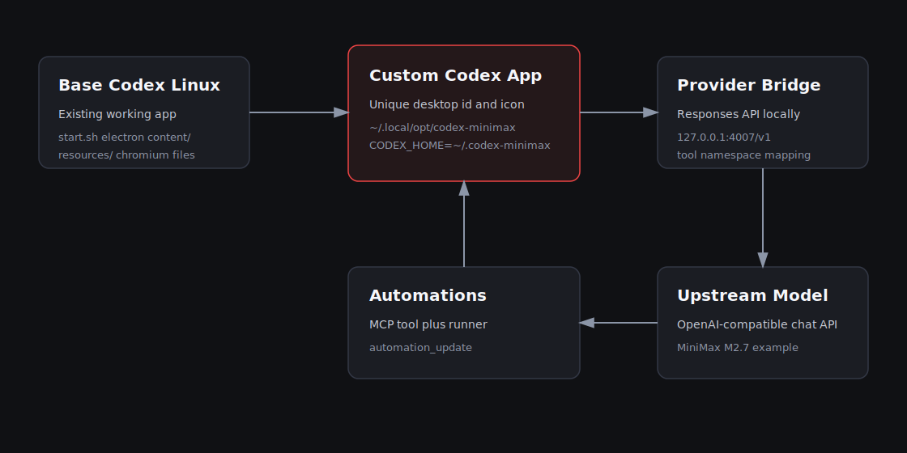

# Architecture

Codex Custom Linux is built around isolation. A custom app should feel like the
normal Codex Desktop app, but it must not share state, ports, launchers, icons,
or model configuration with the primary install.



## Layers

1. **Base Codex Desktop for Linux**
   - Installed by an existing Linux Codex project or by your own local build.
   - Provides Electron, the webview bundle, bundled runtime files, and desktop
     launcher behavior.

2. **Custom App Clone**
   - A separate directory under `~/.local/opt/<app-id>/codex-app`.
   - Heavy runtime files are symlinked to the base app.
   - Files that need branding or app identity are copied.
   - `start.sh` is patched with a unique app id, display name, and webview port.

3. **Custom Codex Home**
   - A separate `CODEX_HOME`, for example `~/.codex-minimax`.
   - Contains `config.toml`, provider env files, bridge scripts, automation
     definitions, and private state.

4. **Responses Bridge**
   - Local HTTP service that speaks the Codex Responses API shape.
   - Converts requests to an upstream OpenAI-compatible Chat Completions API.
   - Converts assistant text and tool calls back to Codex Responses output.

5. **MCP and Automations**
   - Optional MCP server exposes `automation_update`.
   - Runner executes due jobs with the custom Codex CLI wrapper.
   - Same-thread heartbeats use `codex exec resume <thread-id>`.

## Data Flow

```text
Codex Desktop UI
  -> custom CODEX_CLI_PATH
  -> custom CODEX_HOME/config.toml
  -> local bridge http://127.0.0.1:<port>/v1/responses
  -> upstream provider /chat/completions
```

Tool calls take the reverse path. The bridge flattens Codex namespace tools for
Chat Completions providers and restores the namespace before returning tool call
items to Codex.

## Why Copy Some Files

The custom app can symlink most runtime files. A few files should be copied so
the app can have independent identity:

- `start.sh` because it contains the Linux app id, display name, icon name, and
  webview port.
- `electron` because Linux desktop shells often associate runtime windows with
  the executable path.
- `content/` when branding assets need to differ.
- `resources/` directory itself, while linking large inner files.

This keeps disk usage low while avoiding confusing taskbar grouping and icon
collisions.
